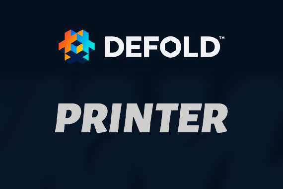
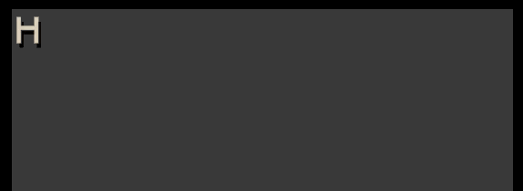

[](https://github.com/sponsors/insality) [](https://ko-fi.com/insality) [](https://www.buymeacoffee.com/insality)

# Printer
A symbol-by-symbol text writer for Defold Engine. Developed for rich game dialogs.
Support UTF-8 symbols (via utf-8.lua). So Russian and other 2+ bytes symbol languages are supported.

# Install

Add library to dependency:
`https://github.com/Insality/defold-printer/archive/master.zip`

If you use **Defold** version less than `1.7.0` use this version:
`https://github.com/Insality/defold-printer/archive/refs/tags/1.1.0.zip`



# Basic Setup

Place printer template on you gui scene. Setup font of text and set size of printer background.

Text will appearing from top-left of this background. You can setup alpha of this node to see text area.

setup in gui module:
```lua
local printer = require "printer.printer"
function init(self)
	self.printer = printer.new(self, template_name)
end
function update(self, dt)
	self.printer:update(dt)
end
function final(self)
	self.printer:final()
end
```

And usage will be like this:

```lua
self.printer:print("This is just simple text")
```

# Styles
Style is lua table with parameters. The default style is the following:
```lua
default = {
	font_height = 28,
	spacing = 1,
	scale = 1,
	waving = false,
	color = "#FFFFFF",
	speed = 0.05,
	appear = 0.01,
	shaking = 0,
	sound = false,
	can_skip = true,
	shake_on_write = 0,
}
```
## Required Default Parameters:
These parameters *must* be present in your default or source style.
- `font_height` in pixels, height of every symbol or image - also used to determine new line position
- `spacing` in pixels, horizontal distance between symbols
- `scale` set scale of every symbol to this value
- `color` hex color code for every symbol the style applies to (ex. "#CACACA")
- `speed` in seconds, the time between each symbol printing
- `appear` in seconds, the speed of a symbol fading in via gui.animate from alpha 0 -> 1
- `shaking` in pixels, the amount to shake every symbol the style applies to.

## Other Parameters:
- `can_skip` if false, printer.instant_appear is disabled while text with this style appears
- `sound` string. Name of the sound played when a symbol appears. TO-DO: Need to rewrite printer.play_sound function.
- `waving` set true to enable waving symbol effect
- `shake_on_write` when true, shake all text symbols when any symbol begins appearing

## Style usage
To setup your styles, use `printer.add_styles( {styles} )`. Styles is array of lua tables with style parameters. We will refer to any key of this array as a 'stylename'.

All new printed text uses the *default* style initially. To change it, enclose a stylename with `{` and `}` before the affected text.
`{my_style}This is styled text`

Use `{/}` to stop using the previously specified style. Example:
`{my_style}This is styled text. {/}But this no`

Use `{n}` to add a line break. Example:
`This row on first line.{n}This line on second line`

You can mix many styles in one row. Example:
`{Illidan_name}Illidan{/}: you are {red}not {waving}prepared{/}!`
In the above example, for the word 'prepared' - any styles from `{red}` that also exist in `{waving}` will be overwritten by `{waving}`. However, parameters in `{red}` that do not exist in `{waving}` will not be affected. The style exit `{/}` removes the effects of all styles.

# Advanced Setup

## Dialog skip and next
To handle next behavior, like to appear all text if it printing, or go to next text if it already showed, you can use something like this on touch event:
```lua
if self.printer.is_print then
	self.printer:instant_appear()
else
	self.index = self.index + 1
	if self.index <= #self.texts then
		self.printer:print(self.texts[self.index])
	end
end
```


## Source predefined styles
Set up a source style to override the default style with a different style for a specific print call.
For example, set up the source:
`printer.add_source_style("bob", "bob_style")`
And specify the source in the print call:
`printer:print("Any text you want", "bob")`
Anytime the *default* style would be used, *bob_style* will be used instead.

## Word styles
You can predefine styles for specific strings.
For example, set up a word style:
`printer.add_word_style("powerful", "cool_style")`
Now, providing the following text to a print call:
`The Defold is amazing, powerful engine`
will print as if you provided:
`The Defold is amazing, {cool_style}powerful{/} engine`

Important points about word styles:
- *The 'word' (really it is just a string) is case sensitive. You can use it for coloring characters' names in your game.*
- *The word style will extend default style of current text, including source style overrides.*
- *Word styles function by modifying your original print string to include style tags, and inserts the style exit `{/}` at the end.*

## Image usage
Insert images in your text using `{image:name}` syntax.
It will place an image node and call `gui.play_flipbook(node, name)` to it.
Example:
`printer:print("Lets trade this for 500 {image:coins}!)`

## Multiple instancing
Create multiple printer instances with `printer.new()`, using different templates.

## Usage examples
```lua
self.printer:print("This is {red}test with red style")
self.printer:print("This is {amazing}multi-{blue}styled text")
self.printer:print("This is text with{n}new line. And image here {image:coins}")
self.printer:print("This is {red}red text and {/}return to default")
self.printer:print("This is with source to use another default style", "Illidan")
```

# API

## printer.new(self, prefab_name)
Create new printer instance to use it for print text
### PARAMETERS
- `self` gui self context
- `prefab_name` printer template name of gui scene

## printer.print(instance, text, [source]
Start printing text on selected instance
### PARAMETERS
- `instance` printer instance, created by *printer.new*
- `text` string, text to start printing
- `source` string, name of source to setup other default style for this text

## printer.is_print
Boolean value to check, if printer now printing text or not

## printer.fadeout

## printer.instant_appear(instance)
Make all nodes for the current text visible immediately.
### PARAMETERS
- `instance` printer instance, created by *printer.new*

## printer.clear(instance)
Clear all current printed text.
### PARAMETERS
- `instance` printer instance, created by *printer.new*

## printer.play_sound(name)
This function is called whenever a symbol is printed.
To play sound, you should override this function with your sound implementation.
### PARAMETERS
- `name` string, name of played sound --> really just a container for whatever argument you might need here.
*For a more complex implementation tied to the printer, create an external function and call it from here.*

## printer.add_styles(styles)
Add custom styles to printer module
### PARAMETERS
- `styles` lua table with style parameters. Elements are: *{style_id: {params}}*

## printer.add_source_style(source, style)
Add a source style to printer module.
### PARAMETERS
- `source` string, source id needed to index added style as source param in *printer.print* function
- `style` string, style id

## printer.add_word_style(word, style)
Add a word style to printer module.
### PARAMETERS
- `word` string, word to wrapped with specified style
- `style` string, style id

## printer.update(self, dt)
Use in the gui `update()` function to update the printer instance.
### PARAMETERS
- `self` gui self context
- `dt` dt parameter from update script

## printer.final(self)
Use in the gui `final()` function to correct final printer component.
### PARAMETERS
- `self` gui self context

# Author
Insality

## Contributors
rocamocha

# Changelog
- \[9-20-22\] Improved functionality of creating new lines. Updated documentation, converted passive voice to active voice where possible. (rocamocha)

# License
My code is under MIT license

[utf8 module](https://github.com/tst2005/lua-utf8string) MIT
